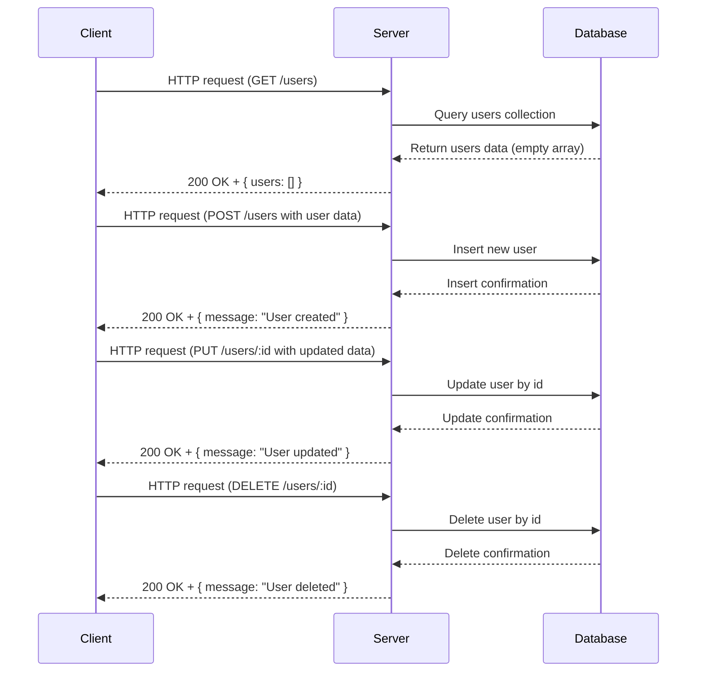

**Analysis of backend source code:**

1. API endpoints:
   - GET /users
   - POST /users
   - PUT /users/:id
   - DELETE /users/:id

2. HTTP methods:
   - GET, POST, PUT, DELETE as above

3. Path parameters:
   - `id` in PUT /users/:id and DELETE /users/:id

4. Query parameters:
   - None explicitly defined

5. Request body schema:
   - Not explicitly defined or parsed by `express.json()` middleware in the code (missing)
   - Assumed for POST and PUT as typical user data (e.g. user object)

6. Response structure:
   - GET /users returns `{ users: [] }` (an array of users)
   - POST /users returns `{ message: "User created" }`
   - PUT /users/:id returns `{ message: "User updated" }`
   - DELETE /users/:id returns `{ message: "User deleted" }`

7. Status codes:
   - The code always uses default, i.e., 200 OK implicitly

8. Authentication requirements:
   - None present or indicated

---

# A) Clean API endpoint list

| Endpoint         | HTTP Method | Path Parameters | Query Parameters | Request Body        | Response                      | Status Codes | Auth Required |
|------------------|-------------|-----------------|------------------|---------------------|-------------------------------|--------------|---------------|
| /users           | GET         | None            | None             | None                | `{ users: Array }`             | 200          | No            |
| /users           | POST        | None            | None             | User object (not defined) | `{ message: "User created" }` | 200          | No            |
| /users/:id       | PUT         | id (string)     | None             | User object (not defined) | `{ message: "User updated" }` | 200          | No            |
| /users/:id       | DELETE      | id (string)     | None             | None                | `{ message: "User deleted" }` | 200          | No            |

---

# B) Short developer documentation

## Users API

- **GET /users**  
  Retrieves a list of users. Returns a JSON object containing an array of users. Currently, this always returns an empty array.

- **POST /users**  
  Creates a new user. Expects user data in the request body (schema not defined). Returns a confirmation message.

- **PUT /users/:id**  
  Updates the user identified by `id`. Expects updated user data in the request body (schema not defined). Returns a confirmation message.

- **DELETE /users/:id**  
  Deletes the user identified by `id`. Returns a confirmation message.

No authentication or authorization is required based on the current implementation.

Status codes are always 200 OK for all responses without error handling.

---

# C) OpenAPI 3.0 YAML specification

```yaml
openapi: 3.0.3
info:
  title: Users API
  version: 1.0.0
paths:
  /users:
    get:
      summary: Retrieves all users
      responses:
        '200':
          description: List of users
          content:
            application/json:
              schema:
                type: object
                properties:
                  users:
                    type: array
                    items:
                      type: object
                    example: []
    post:
      summary: Creates a new user
      requestBody:
        description: User object to create (schema undefined)
        required: true
        content:
          application/json:
            schema:
              type: object
      responses:
        '200':
          description: User created confirmation
          content:
            application/json:
              schema:
                type: object
                properties:
                  message:
                    type: string
                    example: User created
  /users/{id}:
    put:
      summary: Update a user by ID
      parameters:
        - name: id
          in: path
          description: User ID
          required: true
          schema:
            type: string
      requestBody:
        description: User data to update (schema undefined)
        required: true
        content:
          application/json:
            schema:
              type: object
      responses:
        '200':
          description: User updated confirmation
          content:
            application/json:
              schema:
                type: object
                properties:
                  message:
                    type: string
                    example: User updated
    delete:
      summary: Delete a user by ID
      parameters:
        - name: id
          in: path
          description: User ID
          required: true
          schema:
            type: string
      responses:
        '200':
          description: User deleted confirmation
          content:
            application/json:
              schema:
                type: object
                properties:
                  message:
                    type: string
                    example: User deleted
components: {}
```

---

# D) Example request and response

### GET /users

Request:  
```
GET /users HTTP/1.1
Host: example.com
```

Response:  
```json
{
  "users": []
}
```

---

### POST /users

Request:  
```http
POST /users HTTP/1.1
Host: example.com
Content-Type: application/json

{
  "name": "John Doe",
  "email": "john@example.com"
}
```

Response:  
```json
{
  "message": "User created"
}
```

---

### PUT /users/123

Request:  
```http
PUT /users/123 HTTP/1.1
Host: example.com
Content-Type: application/json

{
  "name": "John Updated",
  "email": "john.updated@example.com"
}
```

Response:  
```json
{
  "message": "User updated"
}
```

---

### DELETE /users/123

Request:  
```
DELETE /users/123 HTTP/1.1
Host: example.com
```

Response:  
```json
{
  "message": "User deleted"
}
```

---

# Mermaid sequence diagram

