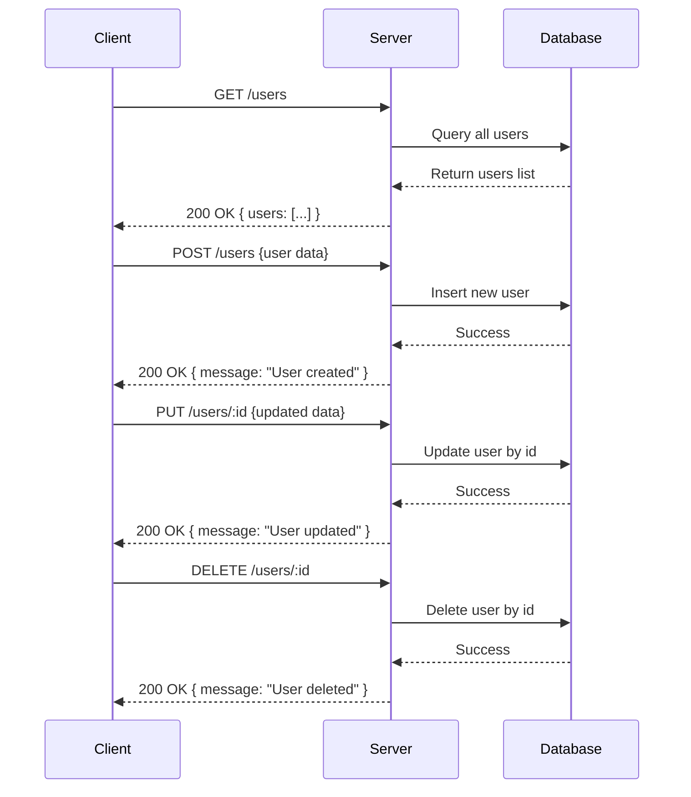

### A) API Endpoint List

| Endpoint       | Method | Path Parameters | Query Parameters | Request Body        | Response Structure          | Status Codes | Auth Required |
|----------------|--------|-----------------|------------------|---------------------|-----------------------------|--------------|---------------|
| /users         | GET    | None            | None             | None                | `{ users: Array }`           | 200          | No            |
| /users         | POST   | None            | None             | (unspecified)        | `{ message: string }`        | 200          | No            |
| /users/:id     | PUT    | `id` (string)   | None             | (unspecified)        | `{ message: string }`        | 200          | No            |
| /users/:id     | DELETE | `id` (string)   | None             | None                | `{ message: string }`        | 200          | No            |

---

### B) Developer Documentation

**GET /users**

- Retrieves a list of users.
- Request Body: None.
- Response: JSON object containing a `users` array.
- Status: 200 OK.
- No authentication required.

---

**POST /users**

- Creates a new user.
- Request Body: User details (not specified in code).
- Response: JSON with a creation message.
- Status: 200 OK.
- No authentication required.

---

**PUT /users/:id**

- Updates the user with specified `id`.
- Path Parameter:
  - `id` (string): ID of the user to update.
- Request Body: Updated user details (not specified in code).
- Response: JSON with an update message.
- Status: 200 OK.
- No authentication required.

---

**DELETE /users/:id**

- Deletes the user with specified `id`.
- Path Parameter:
  - `id` (string): ID of the user to delete.
- Request Body: None.
- Response: JSON with a delete message.
- Status: 200 OK.
- No authentication required.

---

### C) OpenAPI 3.0 YAML Specification

```yaml
openapi: 3.0.3
info:
  title: User Management API
  version: 1.0.0
paths:
  /users:
    get:
      summary: Retrieve all users
      responses:
        '200':
          description: A list of users
          content:
            application/json:
              schema:
                type: object
                properties:
                  users:
                    type: array
                    items:
                      type: object
                      description: User object (unspecified schema)
    post:
      summary: Create a new user
      requestBody:
        description: User object to create (unspecified schema)
        required: true
        content:
          application/json:
            schema:
              type: object
      responses:
        '200':
          description: User created successfully
          content:
            application/json:
              schema:
                type: object
                properties:
                  message:
                    type: string
                    example: User created
  /users/{id}:
    put:
      summary: Update a user by ID
      parameters:
        - name: id
          in: path
          description: User ID to update
          required: true
          schema:
            type: string
      requestBody:
        description: User object with updated info (unspecified schema)
        required: true
        content:
          application/json:
            schema:
              type: object
      responses:
        '200':
          description: User updated successfully
          content:
            application/json:
              schema:
                type: object
                properties:
                  message:
                    type: string
                    example: User updated
    delete:
      summary: Delete a user by ID
      parameters:
        - name: id
          in: path
          description: User ID to delete
          required: true
          schema:
            type: string
      responses:
        '200':
          description: User deleted successfully
          content:
            application/json:
              schema:
                type: object
                properties:
                  message:
                    type: string
                    example: User deleted
components:
  securitySchemes: {}
security: []
```

---

### D) Example Request and Response

**GET /users**

Request:

```http
GET /users HTTP/1.1
Host: example.com
```

Response:

```json
{
  "users": []
}
```

---

**POST /users**

Request:

```http
POST /users HTTP/1.1
Host: example.com
Content-Type: application/json

{
  "name": "John Doe",
  "email": "john@example.com"
}
```

Response:

```json
{
  "message": "User created"
}
```

---

**PUT /users/123**

Request:

```http
PUT /users/123 HTTP/1.1
Host: example.com
Content-Type: application/json

{
  "name": "John Smith"
}
```

Response:

```json
{
  "message": "User updated"
}
```

---

**DELETE /users/123**

Request:

```http
DELETE /users/123 HTTP/1.1
Host: example.com
```

Response:

```json
{
  "message": "User deleted"
}
```

---

### Mermaid Sequence Diagram



---

If you need further details or enhancements, please ask!