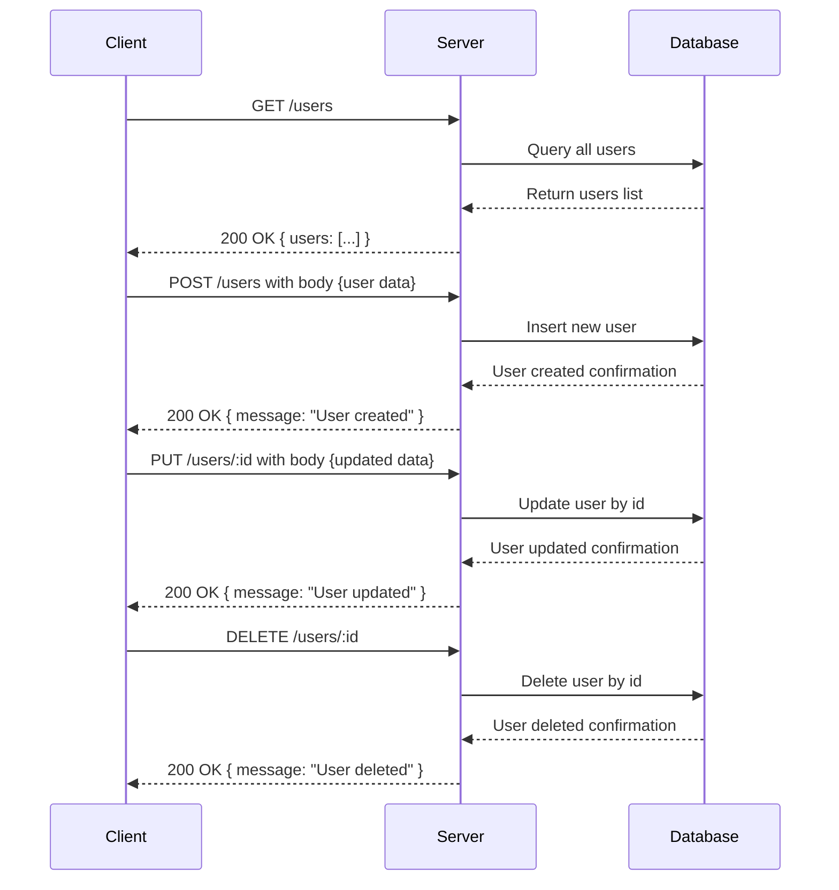

Based on the provided backend source code, here is the analysis and generated documentation:

---

### Analysis

1. **API endpoints**:
   - `/users`
   - `/users/:id`

2. **HTTP methods**:
   - GET `/users`
   - POST `/users`
   - PUT `/users/:id`
   - DELETE `/users/:id`

3. **Path parameters**:
   - `id` (for PUT and DELETE requests on `/users/:id`)

4. **Query parameters**:
   - None specified in code

5. **Request body schema**:
   - Not explicitly defined in the code, but POST and PUT likely expect some JSON user data.

6. **Response structure**:
   - GET `/users`: `{ users: [] }` (returns an array of users)
   - POST `/users`: `{ message: "User created" }`
   - PUT `/users/:id`: `{ message: "User updated" }`
   - DELETE `/users/:id`: `{ message: "User deleted" }`

7. **Status codes**:
   - Not explicitly set, by default Express sends 200 OK for these responses.

8. **Authentication requirements**:
   - None indicated by code (no middleware or checks)

---

### A) Clean API Endpoint List

| Method | Endpoint      | Description          | Path Parameters | Query Parameters | Request Body     | Response                      |
|--------|---------------|----------------------|-----------------|------------------|------------------|-------------------------------|
| GET    | /users        | Retrieve all users   | None            | None             | None             | `{ users: Array }`            |
| POST   | /users        | Create a new user    | None            | None             | JSON (user data) | `{ message: "User created" }`|
| PUT    | /users/:id    | Update user by ID    | id              | None             | JSON (user data) | `{ message: "User updated" }`|
| DELETE | /users/:id    | Delete user by ID    | id              | None             | None             | `{ message: "User deleted" }`|

---

### B) Short Developer Documentation

#### 1. GET /users
Retrieve a list of users.

- **Path Parameters:** None
- **Query Parameters:** None
- **Request Body:** None
- **Response:** JSON object with `users` array.
- **Status Code:** 200 OK
- **Authentication:** None

#### 2. POST /users
Create a new user.

- **Path Parameters:** None
- **Query Parameters:** None
- **Request Body:** JSON containing user details (not specified)
- **Response:** Confirmation message
- **Status Code:** 200 OK
- **Authentication:** None

#### 3. PUT /users/:id
Update an existing user by `id`.

- **Path Parameters:** `id` - user identifier
- **Query Parameters:** None
- **Request Body:** JSON containing updated user details (not specified)
- **Response:** Confirmation message
- **Status Code:** 200 OK
- **Authentication:** None

#### 4. DELETE /users/:id
Delete a user by `id`.

- **Path Parameters:** `id` - user identifier
- **Query Parameters:** None
- **Request Body:** None
- **Response:** Confirmation message
- **Status Code:** 200 OK
- **Authentication:** None

---

### C) OpenAPI 3.0 YAML Specification

```yaml
openapi: 3.0.3
info:
  title: User API
  version: 1.0.0
  description: API for managing users.
paths:
  /users:
    get:
      summary: Retrieve all users
      responses:
        '200':
          description: A list of users
          content:
            application/json:
              schema:
                type: object
                properties:
                  users:
                    type: array
                    items:
                      type: object
                example:
                  users: []
    post:
      summary: Create a new user
      requestBody:
        description: User information to create
        required: true
        content:
          application/json:
            schema:
              type: object
              # Schema undefined in source, leave as free form
      responses:
        '200':
          description: User created confirmation
          content:
            application/json:
              schema:
                type: object
                properties:
                  message:
                    type: string
                example:
                  message: User created

  /users/{id}:
    parameters:
      - in: path
        name: id
        required: true
        schema:
          type: string
        description: The user ID
    put:
      summary: Update a user
      requestBody:
        description: User information to update
        required: true
        content:
          application/json:
            schema:
              type: object
              # Schema undefined in source, leave as free form
      responses:
        '200':
          description: User updated confirmation
          content:
            application/json:
              schema:
                type: object
                properties:
                  message:
                    type: string
                example:
                  message: User updated
    delete:
      summary: Delete a user
      responses:
        '200':
          description: User deleted confirmation
          content:
            application/json:
              schema:
                type: object
                properties:
                  message:
                    type: string
                example:
                  message: User deleted
components: {}
```

---

### D) Example Request and Response

**GET /users**

Request:
```http
GET /users HTTP/1.1
Host: example.com
```

Response:
```json
{
  "users": []
}
```

---

**POST /users**

Request:
```http
POST /users HTTP/1.1
Host: example.com
Content-Type: application/json

{
  "name": "Alice",
  "email": "alice@example.com"
}
```

Response:
```json
{
  "message": "User created"
}
```

---

**PUT /users/123**

Request:
```http
PUT /users/123 HTTP/1.1
Host: example.com
Content-Type: application/json

{
  "email": "alice.new@example.com"
}
```

Response:
```json
{
  "message": "User updated"
}
```

---

**DELETE /users/123**

Request:
```http
DELETE /users/123 HTTP/1.1
Host: example.com
```

Response:
```json
{
  "message": "User deleted"
}
```

---

### Mermaid Sequence Diagram



---

If you need further refinement or enhancement, please let me know!