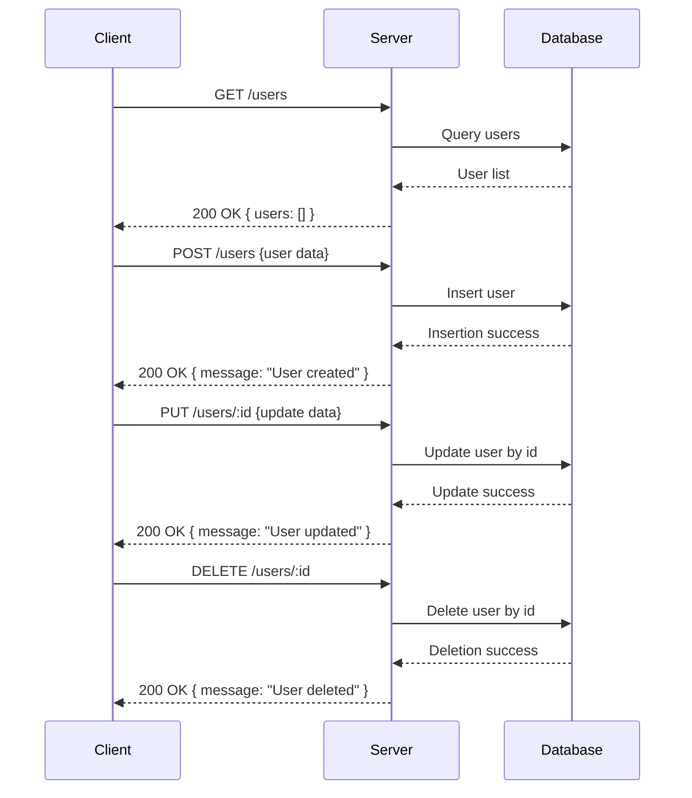

The provided code is backend source code using Express.js, defining a simple user management API with basic CRUD endpoints.

---

### A) API Endpoint List

| Endpoint       | HTTP Method | Path Parameters | Query Parameters | Request Body           | Response Structure             | Status Codes | Auth Required |
|----------------|-------------|-----------------|------------------|------------------------|-------------------------------|--------------|---------------|
| /users         | GET         | None            | None             | None                   | `{ users: Array }`             | 200          | No            |
| /users         | POST        | None            | None             | Not explicitly defined | `{ message: String }`          | 200          | No            |
| /users/:id     | PUT         | `id` (string)   | None             | Not explicitly defined | `{ message: String }`          | 200          | No            |
| /users/:id     | DELETE      | `id` (string)   | None             | None                   | `{ message: String }`          | 200          | No            |

---

### B) Short Developer Documentation

#### 1. Get Users  
**GET /users**  
Returns a list of users.  
- **Request:** No parameters, no body.  
- **Response:** JSON object containing an array of users.  
- **Example Response:** `{ "users": [] }`

#### 2. Create User  
**POST /users**  
Creates a new user.  
- **Request:** JSON body expected (schema not defined explicitly).  
- **Response:** JSON object with success message.  
- **Example Response:** `{ "message": "User created" }`

#### 3. Update User  
**PUT /users/:id**  
Updates an existing user by ID.  
- **Path Parameter:** `id` - the user ID.  
- **Request:** JSON body expected (schema not defined explicitly).  
- **Response:** JSON object with success message.  
- **Example Response:** `{ "message": "User updated" }`

#### 4. Delete User  
**DELETE /users/:id**  
Deletes a user by ID.  
- **Path Parameter:** `id` - the user ID.  
- **Request:** None.  
- **Response:** JSON object with success message.  
- **Example Response:** `{ "message": "User deleted" }`

---

### C) OpenAPI 3.0 YAML Specification

```yaml
openapi: 3.0.3
info:
  title: User Management API
  version: 1.0.0
paths:
  /users:
    get:
      summary: Get all users
      responses:
        '200':
          description: List of users
          content:
            application/json:
              schema:
                type: object
                properties:
                  users:
                    type: array
                    items:
                      type: object
                    description: List of user objects
    post:
      summary: Create a user
      requestBody:
        description: User object to create (schema not defined)
        required: true
        content:
          application/json:
            schema:
              type: object
      responses:
        '200':
          description: User created confirmation
          content:
            application/json:
              schema:
                type: object
                properties:
                  message:
                    type: string
                    example: User created

  /users/{id}:
    parameters:
      - in: path
        name: id
        schema:
          type: string
        required: true
        description: User ID
    put:
      summary: Update a user
      requestBody:
        description: User updates (schema not defined)
        required: true
        content:
          application/json:
            schema:
              type: object
      responses:
        '200':
          description: User update confirmation
          content:
            application/json:
              schema:
                type: object
                properties:
                  message:
                    type: string
                    example: User updated
    delete:
      summary: Delete a user
      responses:
        '200':
          description: User deletion confirmation
          content:
            application/json:
              schema:
                type: object
                properties:
                  message:
                    type: string
                    example: User deleted
components: {}
```

---

### D) Example Request and Response

#### Example - GET /users

Request:
```http
GET /users HTTP/1.1
Host: example.com
```

Response:
```json
{
  "users": []
}
```

#### Example - POST /users

Request:
```http
POST /users HTTP/1.1
Host: example.com
Content-Type: application/json

{
  "name": "John Doe",
  "email": "john@example.com"
}
```

Response:
```json
{
  "message": "User created"
}
```

#### Example - PUT /users/123

Request:
```http
PUT /users/123 HTTP/1.1
Host: example.com
Content-Type: application/json

{
  "email": "john.new@example.com"
}
```

Response:
```json
{
  "message": "User updated"
}
```

#### Example - DELETE /users/123

Request:
```http
DELETE /users/123 HTTP/1.1
Host: example.com
```

Response:
```json
{
  "message": "User deleted"
}
```

---

### Mermaid Sequence Diagram



---

No authentication logic was detected in the provided code.