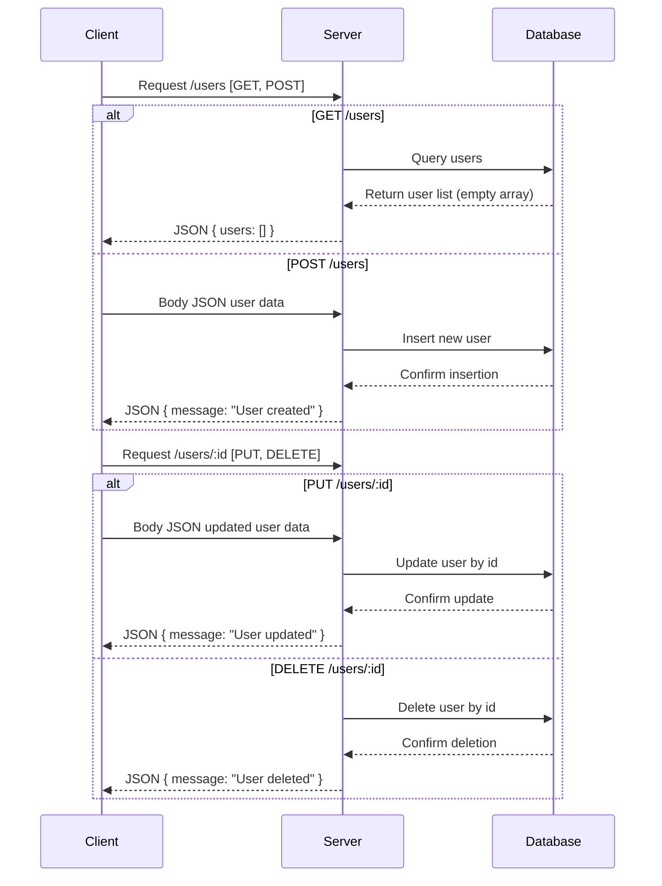

### Analysis of the provided code

The code is a simple Express backend with 4 API endpoints related to user management.

---

## A) API endpoint list

| Endpoint       | HTTP Method | Path Parameters | Query Parameters | Request Body         | Response                         | Status Codes | Authentication |
|----------------|-------------|-----------------|------------------|----------------------|---------------------------------|--------------|----------------|
| /users         | GET         | None            | None             | None                 | `{ users: Array }`               | 200          | No             |
| /users         | POST        | None            | None             | Not detailed         | `{ message: String }`            | 200          | No             |
| /users/:id     | PUT         | id (string)     | None             | Not detailed         | `{ message: String }`            | 200          | No             |
| /users/:id     | DELETE      | id (string)     | None             | None                 | `{ message: String }`            | 200          | No             |

---

## B) Short developer documentation

### 1. GET /users  
Fetch the list of users.  
- **Request parameters:** None  
- **Response:** JSON object containing a `users` array (empty in current implementation).  
- **Status code:** 200 OK  

### 2. POST /users  
Create a new user.  
- **Request body:** Not specified (assumed JSON with user info).  
- **Response:** JSON object with a `message` confirming creation.  
- **Status code:** 200 OK  

### 3. PUT /users/:id  
Update an existing user by `id`.  
- **Path parameter:** `id` - the ID of the user to update.  
- **Request body:** Not specified (assumed JSON with update info).  
- **Response:** JSON object with a `message` confirming update.  
- **Status code:** 200 OK  

### 4. DELETE /users/:id  
Delete a user by `id`.  
- **Path parameter:** `id` - the ID of the user to delete.  
- **Response:** JSON object with a `message` confirming deletion.  
- **Status code:** 200 OK  

### Authentication  
No authentication is present in the current implementation.

---

## C) OpenAPI 3.0 YAML specification

```yaml
openapi: 3.0.3
info:
  title: User Management API
  version: 1.0.0
paths:
  /users:
    get:
      summary: Get list of users
      responses:
        '200':
          description: Successful response with users list
          content:
            application/json:
              schema:
                type: object
                properties:
                  users:
                    type: array
                    items:
                      type: object
                example:
                  users: []
    post:
      summary: Create a new user
      requestBody:
        required: false
        content:
          application/json:
            schema:
              type: object
      responses:
        '200':
          description: User created successfully
          content:
            application/json:
              schema:
                type: object
                properties:
                  message:
                    type: string
                example:
                  message: User created
  /users/{id}:
    put:
      summary: Update user by ID
      parameters:
        - name: id
          in: path
          required: true
          schema:
            type: string
      requestBody:
        required: false
        content:
          application/json:
            schema:
              type: object
      responses:
        '200':
          description: User updated successfully
          content:
            application/json:
              schema:
                type: object
                properties:
                  message:
                    type: string
                example:
                  message: User updated
    delete:
      summary: Delete user by ID
      parameters:
        - name: id
          in: path
          required: true
          schema:
            type: string
      responses:
        '200':
          description: User deleted successfully
          content:
            application/json:
              schema:
                type: object
                properties:
                  message:
                    type: string
                example:
                  message: User deleted
components: {}
```

---

## D) Example request and response

### Example: GET /users

**Request:**  
```
GET /users HTTP/1.1
Host: example.com
```

**Response:**  
```json
{
  "users": []
}
```

---

### Example: POST /users

**Request:**  
```
POST /users HTTP/1.1
Host: example.com
Content-Type: application/json

{
  "name": "Alice",
  "email": "alice@example.com"
}
```

**Response:**  
```json
{
  "message": "User created"
}
```

---

### Example: PUT /users/123

**Request:**  
```
PUT /users/123 HTTP/1.1
Host: example.com
Content-Type: application/json

{
  "email": "alice_new@example.com"
}
```

**Response:**  
```json
{
  "message": "User updated"
}
```

---

### Example: DELETE /users/123

**Request:**  
```
DELETE /users/123 HTTP/1.1
Host: example.com
```

**Response:**  
```json
{
  "message": "User deleted"
}
```

---

## Mermaid sequence diagram


