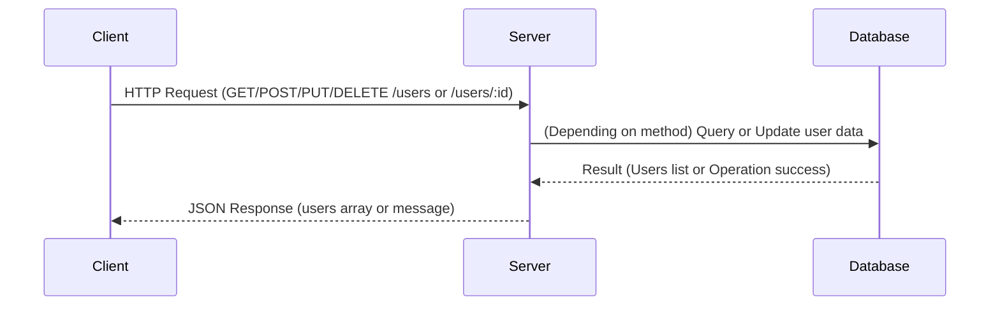

Analyzing the provided backend source code, here is the extracted API information:

---

### A) Clean API Endpoint List

| HTTP Method | Endpoint       | Path Parameters | Query Parameters | Request Body        | Response                     | Status Codes | Authentication Required |
|-------------|----------------|-----------------|------------------|---------------------|------------------------------|--------------|-------------------------|
| GET         | /users         | None            | None             | None                | `{ users: Array }`            | 200          | No                      |
| POST        | /users         | None            | None             | Not specified       | `{ message: string }`         | 200          | No                      |
| PUT         | /users/:id     | `id` (string)   | None             | Not specified       | `{ message: string }`         | 200          | No                      |
| DELETE      | /users/:id     | `id` (string)   | None             | None                | `{ message: string }`         | 200          | No                      |

---

### B) Short Developer Documentation

1. **GET /users**  
   Retrieves a list of users.  
   - **Parameters:** None  
   - **Response:**  
     ```json
     {
       "users": []
     }
     ```  
   - **Status Code:** 200 OK  
   - **Authentication:** None

2. **POST /users**  
   Creates a new user.  
   - **Parameters:** None in path or query  
   - **Request Body:** Not defined in the code  
   - **Response:**  
     ```json
     {
       "message": "User created"
     }
     ```  
   - **Status Code:** 200 OK  
   - **Authentication:** None

3. **PUT /users/:id**  
   Updates an existing user by ID.  
   - **Path Parameters:** `id` (user identifier)  
   - **Request Body:** Not defined in the code  
   - **Response:**  
     ```json
     {
       "message": "User updated"
     }
     ```  
   - **Status Code:** 200 OK  
   - **Authentication:** None

4. **DELETE /users/:id**  
   Deletes a user by ID.  
   - **Path Parameters:** `id` (user identifier)  
   - **Response:**  
     ```json
     {
       "message": "User deleted"
     }
     ```  
   - **Status Code:** 200 OK  
   - **Authentication:** None

---

### C) OpenAPI 3.0 YAML Specification

```yaml
openapi: 3.0.3
info:
  title: User API
  version: 1.0.0
paths:
  /users:
    get:
      summary: Retrieve list of users
      responses:
        '200':
          description: List of users
          content:
            application/json:
              schema:
                type: object
                properties:
                  users:
                    type: array
                    items:
                      type: object
    post:
      summary: Create a user
      requestBody:
        content:
          application/json:
            schema:
              type: object
              description: Not specified in code
      responses:
        '200':
          description: User created
          content:
            application/json:
              schema:
                type: object
                properties:
                  message:
                    type: string
                    example: User created

  /users/{id}:
    parameters:
      - in: path
        name: id
        required: true
        schema:
          type: string
        description: User ID
    put:
      summary: Update a user by ID
      requestBody:
        content:
          application/json:
            schema:
              type: object
              description: Not specified in code
      responses:
        '200':
          description: User updated
          content:
            application/json:
              schema:
                type: object
                properties:
                  message:
                    type: string
                    example: User updated
    delete:
      summary: Delete a user by ID
      responses:
        '200':
          description: User deleted
          content:
            application/json:
              schema:
                type: object
                properties:
                  message:
                    type: string
                    example: User deleted
```

---

### D) Example Request and Response

#### Example: Get list of users

- **Request:**

```
GET /users
Host: example.com
```

- **Response:**

```json
{
  "users": []
}
```

---

#### Example: Create a user

- **Request:**

```
POST /users
Host: example.com
Content-Type: application/json

{
  "name": "John Doe",
  "email": "john@example.com"
}
```

- **Response:**

```json
{
  "message": "User created"
}
```

---

#### Example: Update user by ID

- **Request:**

```
PUT /users/123
Host: example.com
Content-Type: application/json

{
  "name": "John Updated",
  "email": "john.updated@example.com"
}
```

- **Response:**

```json
{
  "message": "User updated"
}
```

---

#### Example: Delete user by ID

- **Request:**

```
DELETE /users/123
Host: example.com
```

- **Response:**

```json
{
  "message": "User deleted"
}
```

---

### Mermaid Sequence Diagram



---

**Note:**  
- No authentication middleware or tokens are shown in the provided code.  
- Request body schema is not explicitly defined (usually should parse and validate the body with `express.json()` middleware).  
- Status codes default to 200 in all handlers.  
- The database connection or logic is not present; the responses are hardcoded.