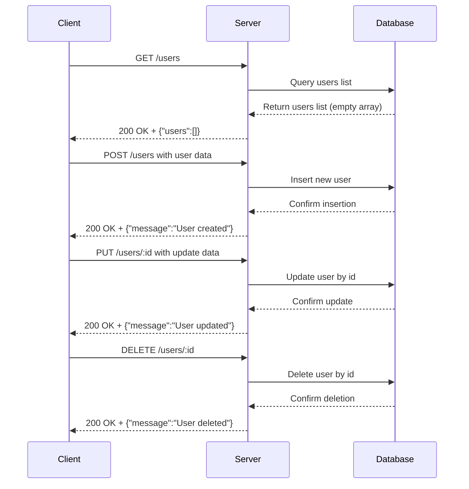

**Analysis of backend code:**

1. **API endpoints:**
   - `GET /users`
   - `POST /users`
   - `PUT /users/:id`
   - `DELETE /users/:id`

2. **HTTP methods:**
   - GET
   - POST
   - PUT
   - DELETE

3. **Path parameters:**
   - `id` in `/users/:id` (for PUT and DELETE)

4. **Query parameters:**  
   - None explicitly used or documented in code.

5. **Request body schema:**
   - No explicit request body schema given in code (no `req.body` processing or validation). But POST and PUT typically require user data.

6. **Response structure:**
   - GET /users: `{ users: [] }` (empty array)
   - POST /users: `{ message: "User created" }`
   - PUT /users/:id: `{ message: "User updated" }`
   - DELETE /users/:id: `{ message: "User deleted" }`

7. **Status codes:**
   - All responses default to 200 (no explicit status codes set)

8. **Authentication requirements:**
   - None (no authentication middleware or checks)

---

## A) Clean API endpoint list

| HTTP Method | Endpoint       | Description          | Path Params | Request Body | Response                        |
|-------------|----------------|----------------------|-------------|--------------|--------------------------------|
| GET         | /users         | List all users       | None        | None         | `{ "users": [] }`               |
| POST        | /users         | Create a new user    | None        | User data    | `{ "message": "User created" }`|
| PUT         | /users/:id     | Update a user by ID  | id          | User data    | `{ "message": "User updated" }`|
| DELETE      | /users/:id     | Delete a user by ID  | id          | None         | `{ "message": "User deleted" }`|

---

## B) Short developer documentation

### GET /users
Retrieve a list of users.  
- **Response:** JSON with array of users (currently returns empty array).  
- **Status codes:** 200 OK

### POST /users
Create a new user.  
- **Request body:** User information (schema not specified in code)  
- **Response:** Confirmation message `{ message: "User created" }`  
- **Status codes:** 200 OK

### PUT /users/:id
Update an existing user by ID.  
- **Path parameter:** `id` (string or number identifying the user)  
- **Request body:** User updated data (schema not specified)  
- **Response:** Confirmation message `{ message: "User updated" }`  
- **Status codes:** 200 OK

### DELETE /users/:id
Delete a user by ID.  
- **Path parameter:** `id`  
- **Response:** Confirmation message `{ message: "User deleted" }`  
- **Status codes:** 200 OK

**Authentication:** No authentication enforced.

---

## C) OpenAPI 3.0 YAML specification

```yaml
openapi: 3.0.3
info:
  title: User Management API
  version: "1.0.0"
paths:
  /users:
    get:
      summary: List all users
      responses:
        '200':
          description: Success - Returns list of users
          content:
            application/json:
              schema:
                type: object
                properties:
                  users:
                    type: array
                    items:
                      type: object
                example:
                  users: []
    post:
      summary: Create a new user
      requestBody:
        description: User data to create a user
        required: true
        content:
          application/json:
            schema:
              type: object
              description: User object (schema unspecified)
      responses:
        '200':
          description: User created
          content:
            application/json:
              schema:
                type: object
                properties:
                  message:
                    type: string
                    example: User created
  /users/{id}:
    parameters:
      - name: id
        in: path
        required: true
        schema:
          type: string
        description: User ID
    put:
      summary: Update a user by ID
      requestBody:
        description: Updated user data
        required: true
        content:
          application/json:
            schema:
              type: object
              description: User update object (schema unspecified)
      responses:
        '200':
          description: User updated
          content:
            application/json:
              schema:
                type: object
                properties:
                  message:
                    type: string
                    example: User updated
    delete:
      summary: Delete a user by ID
      responses:
        '200':
          description: User deleted
          content:
            application/json:
              schema:
                type: object
                properties:
                  message:
                    type: string
                    example: User deleted
```

---

## D) Example request and response

### Example 1: GET /users

**Request:**  
```
GET /users HTTP/1.1
Host: example.com
Accept: application/json
```

**Response:**  
```json
HTTP/1.1 200 OK
Content-Type: application/json

{
  "users": []
}
```

---

### Example 2: POST /users

**Request:**  
```json
POST /users HTTP/1.1
Host: example.com
Content-Type: application/json

{
  "name": "Jane Doe",
  "email": "jane@example.com"
}
```

**Response:**  
```json
HTTP/1.1 200 OK
Content-Type: application/json

{
  "message": "User created"
}
```

---

### Example 3: PUT /users/123

**Request:**  
```json
PUT /users/123 HTTP/1.1
Host: example.com
Content-Type: application/json

{
  "email": "newemail@example.com"
}
```

**Response:**  
```json
HTTP/1.1 200 OK
Content-Type: application/json

{
  "message": "User updated"
}
```

---

### Example 4: DELETE /users/123

**Request:**  
```
DELETE /users/123 HTTP/1.1
Host: example.com
```

**Response:**  
```json
HTTP/1.1 200 OK
Content-Type: application/json

{
  "message": "User deleted"
}
```

---

## Mermaid sequence diagram

