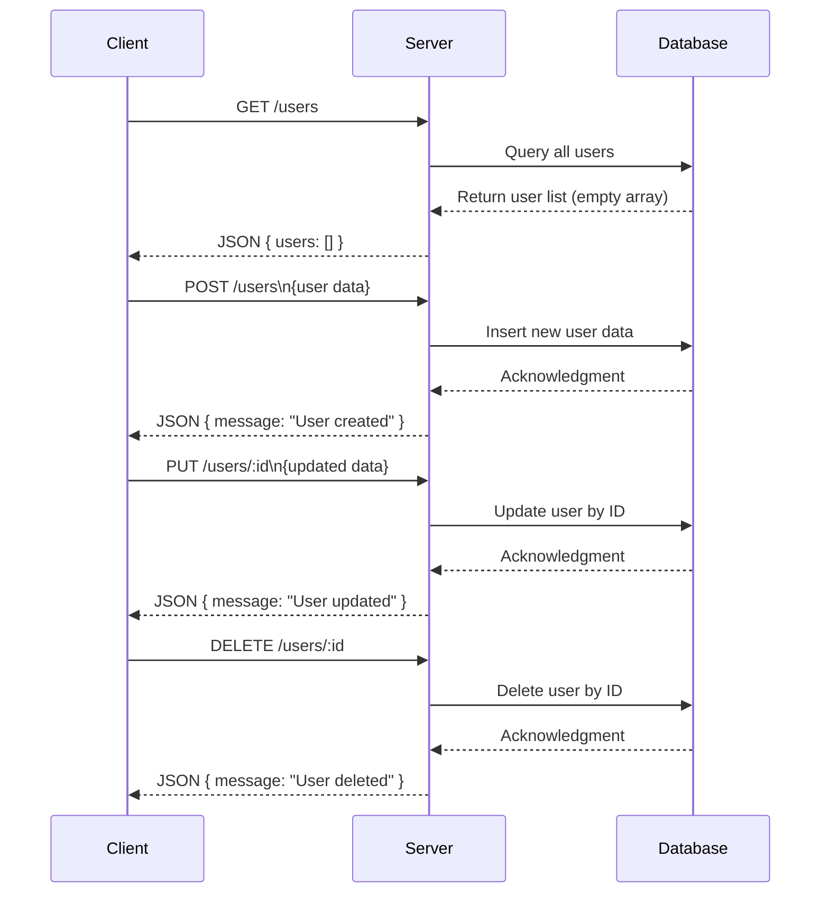

### A) Clean API Endpoint List

| HTTP Method | Endpoint       | Description          | Path Params | Query Params | Request Body | Response                     | Status Codes | Authentication |
|-------------|----------------|----------------------|-------------|--------------|--------------|------------------------------|--------------|----------------|
| GET         | /users         | Retrieve all users   | None        | None         | None         | JSON: `{ users: array }`      | 200          | No             |
| POST        | /users         | Create a new user    | None        | None         | Unknown      | JSON: `{ message: string }`   | 200          | No             |
| PUT         | /users/:id     | Update a user        | `id`        | None         | Unknown      | JSON: `{ message: string }`   | 200          | No             |
| DELETE      | /users/:id     | Delete a user        | `id`        | None         | None         | JSON: `{ message: string }`   | 200          | No             |

---

### B) Short Developer Documentation

- **GET /users**
  - Fetches the list of all users.
  - Response contains a JSON object with an array of users.
  
- **POST /users**
  - Creates a new user.
  - Accepts a JSON request body (schema not defined in the source).
  - Responds with a message indicating the user was created.
  
- **PUT /users/:id**
  - Updates user data for the user with the specified `id`.
  - Path parameter: `id` (user identifier).
  - Accepts a JSON request body (schema not defined).
  - Responds with a message confirming update.
  
- **DELETE /users/:id**
  - Deletes the user identified by `id`.
  - Path parameter: `id`.
  - Responds with a message confirming deletion.

**Note:** No authentication middleware or authorization checks are present.

---

### C) OpenAPI 3.0 YAML Specification

```yaml
openapi: 3.0.3
info:
  title: User Management API
  version: 1.0.0
paths:
  /users:
    get:
      summary: Retrieve all users
      responses:
        '200':
          description: List of users
          content:
            application/json:
              schema:
                type: object
                properties:
                  users:
                    type: array
                    items:
                      type: object
    post:
      summary: Create a new user
      requestBody:
        description: User data to create (schema not specified)
        required: true
        content:
          application/json:
            schema:
              type: object
      responses:
        '200':
          description: User creation confirmation
          content:
            application/json:
              schema:
                type: object
                properties:
                  message:
                    type: string
  /users/{id}:
    put:
      summary: Update a user
      parameters:
        - name: id
          in: path
          required: true
          schema:
            type: string
      requestBody:
        description: User data to update (schema not specified)
        required: true
        content:
          application/json:
            schema:
              type: object
      responses:
        '200':
          description: User update confirmation
          content:
            application/json:
              schema:
                type: object
                properties:
                  message:
                    type: string
    delete:
      summary: Delete a user
      parameters:
        - name: id
          in: path
          required: true
          schema:
            type: string
      responses:
        '200':
          description: User deletion confirmation
          content:
            application/json:
              schema:
                type: object
                properties:
                  message:
                    type: string
```

---

### D) Example Request and Response

**GET /users**

Request:

```http
GET /users HTTP/1.1
Host: example.com
```

Response:

```json
{
  "users": []
}
```

---

**POST /users**

Request:

```http
POST /users HTTP/1.1
Host: example.com
Content-Type: application/json

{
  "name": "John Doe",
  "email": "john@example.com"
}
```

Response:

```json
{
  "message": "User created"
}
```

---

**PUT /users/123**

Request:

```http
PUT /users/123 HTTP/1.1
Host: example.com
Content-Type: application/json

{
  "name": "Jane Doe"
}
```

Response:

```json
{
  "message": "User updated"
}
```

---

**DELETE /users/123**

Request:

```http
DELETE /users/123 HTTP/1.1
Host: example.com
```

Response:

```json
{
  "message": "User deleted"
}
```

---

### Mermaid Sequence Diagram

