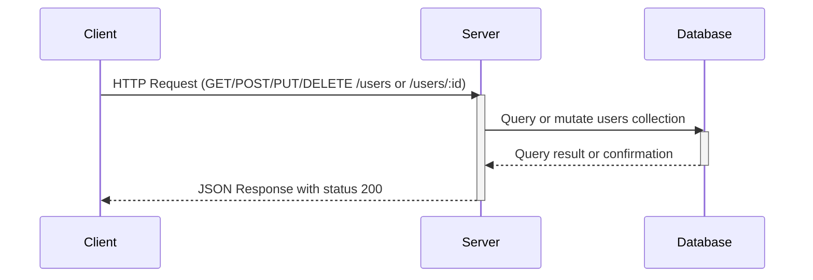

### Analysis of backend source code:

The code is an Express.js app with four API endpoints for user management:

1. `GET /users`
2. `POST /users`
3. `PUT /users/:id`
4. `DELETE /users/:id`

No request body schema or query parameters are explicitly validated or defined in the code.

No authentication middleware or logic is present.

Response structure is JSON with either a `users` array or a `{ message: string }` object.

No explicit status codes are set, so default 200 OK is used.

---

## A) Clean API endpoint list

| Endpoint       | HTTP Method | Path Parameters | Query Parameters | Request Body        | Response                        | Status Codes | Authentication |
|----------------|-------------|-----------------|------------------|---------------------|--------------------------------|--------------|----------------|
| /users         | GET         | None            | None             | None                | `{ users: [] }`                 | 200          | No             |
| /users         | POST        | None            | None             | Not defined (assumed JSON) | `{ message: "User created" }`  | 200          | No             |
| /users/:id     | PUT         | `id` (string)   | None             | Not defined (assumed JSON) | `{ message: "User updated" }`  | 200          | No             |
| /users/:id     | DELETE      | `id` (string)   | None             | None                | `{ message: "User deleted" }`  | 200          | No             |

---

## B) Short developer documentation

### User API

- **GET /users**  
  Retrieves a list of users.  
  - Response: `{ users: [] }` (array of users, currently empty)  
  - Status: 200 OK

- **POST /users**  
  Creates a new user. The request body is not explicitly defined but assumed to be JSON.  
  - Response: `{ message: "User created" }`  
  - Status: 200 OK

- **PUT /users/:id**  
  Updates an existing user identified by `id`. The request body is not explicitly defined but assumed to be JSON.  
  - Path parameter: `id` (string)  
  - Response: `{ message: "User updated" }`  
  - Status: 200 OK

- **DELETE /users/:id**  
  Deletes a user identified by `id`.  
  - Path parameter: `id` (string)  
  - Response: `{ message: "User deleted" }`  
  - Status: 200 OK

**Note:** No authentication or validation logic present.

---

## C) OpenAPI 3.0 YAML specification

```yaml
openapi: 3.0.3
info:
  title: User API
  version: "1.0"
servers:
  - url: http://localhost:3000
paths:
  /users:
    get:
      summary: Get list of users
      responses:
        '200':
          description: Successful response with users list
          content:
            application/json:
              schema:
                type: object
                properties:
                  users:
                    type: array
                    items:
                      type: object
                example:
                  users: []
    post:
      summary: Create a new user
      requestBody:
        required: true
        content:
          application/json:
            schema:
              type: object
              description: User creation payload (schema unspecified)
      responses:
        '200':
          description: User created successfully
          content:
            application/json:
              schema:
                type: object
                properties:
                  message:
                    type: string
                example:
                  message: User created
  /users/{id}:
    put:
      summary: Update user by ID
      parameters:
        - name: id
          in: path
          required: true
          schema:
            type: string
      requestBody:
        required: true
        content:
          application/json:
            schema:
              type: object
              description: User update payload (schema unspecified)
      responses:
        '200':
          description: User updated successfully
          content:
            application/json:
              schema:
                type: object
                properties:
                  message:
                    type: string
                example:
                  message: User updated
    delete:
      summary: Delete user by ID
      parameters:
        - name: id
          in: path
          required: true
          schema:
            type: string
      responses:
        '200':
          description: User deleted successfully
          content:
            application/json:
              schema:
                type: object
                properties:
                  message:
                    type: string
                example:
                  message: User deleted
components: {}
```

---

## D) Example request and response

### GET /users

Request:

```
GET /users HTTP/1.1
Host: localhost:3000
```

Response:

```json
{
  "users": []
}
```

---

### POST /users

Request:

```
POST /users HTTP/1.1
Host: localhost:3000
Content-Type: application/json

{
  "name": "John Doe",
  "email": "john@example.com"
}
```

Response:

```json
{
  "message": "User created"
}
```

---

### PUT /users/123

Request:

```
PUT /users/123 HTTP/1.1
Host: localhost:3000
Content-Type: application/json

{
  "name": "Jane Doe"
}
```

Response:

```json
{
  "message": "User updated"
}
```

---

### DELETE /users/123

Request:

```
DELETE /users/123 HTTP/1.1
Host: localhost:3000
```

Response:

```json
{
  "message": "User deleted"
}
```

---

## Mermaid sequence diagram of API request flow



---

If you want me to generate code for validation, authentication, or more detailed schemas, please provide additional source or requirements.